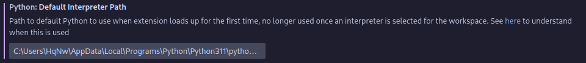

# change the default interpreter 
in the terminal window type `where python`

should look like this 

copy the one that has `Programs\Python\Python*\python.exe`  in it, then open vs code settings and past this in the search `@ext:ms-python.python python.defaultInterpreterPath`

then past the path you copied in the text box 

restart vs-code

# install pip
in the terminal type `curl https://bootstrap.pypa.io/get-pip.py -o get-pip.py`

should look like this

then type `python get-pip.py`

# install mysql connector

in the terminal type `pip install mysql-connector-python`

everything should work now : )

